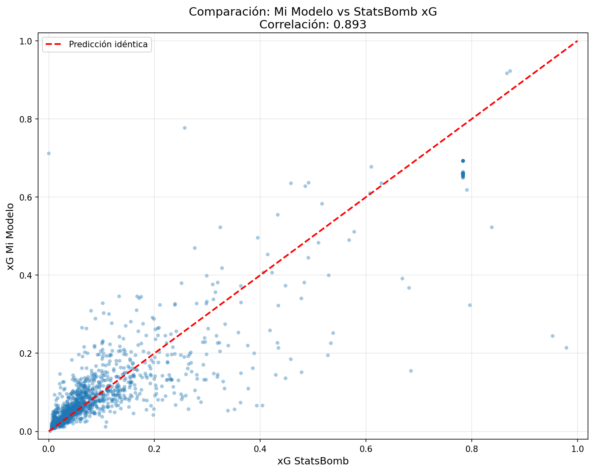
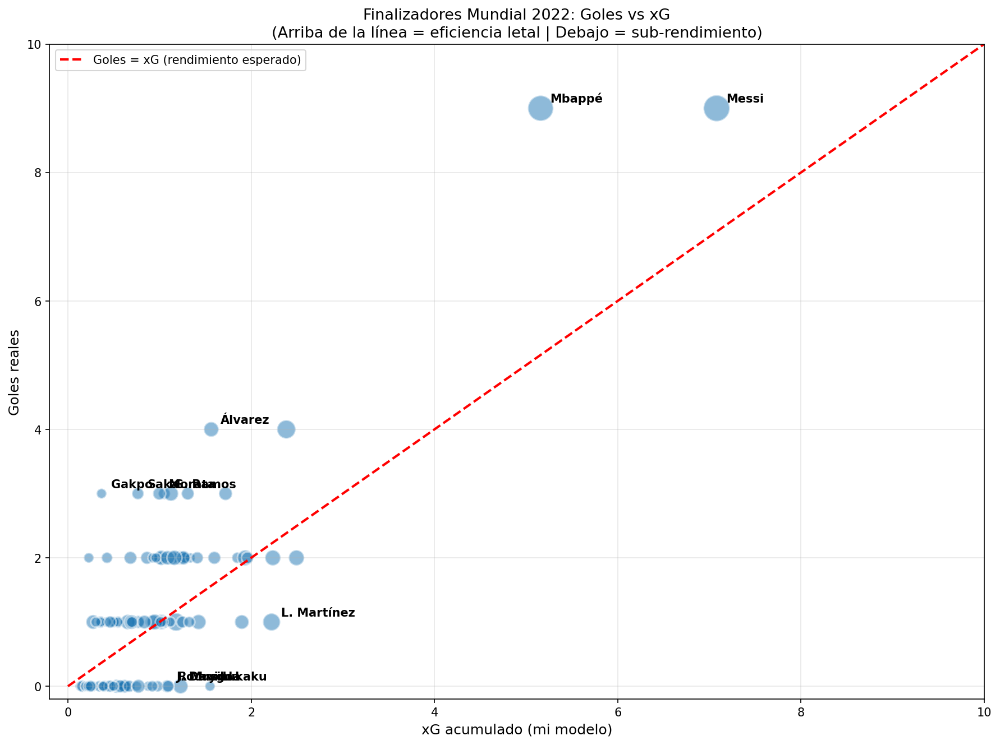

# Football Analytics Portfolio

Portafolio de análisis de datos en fútbol usando Python, StatsBomb Open Data y herramientas modernas de visualización deportiva.

## Stack Técnico

- **Lenguajes:** Python, SQL
- **Procesamiento:** pandas, numpy, DuckDB
- **Visualización:** matplotlib, mplsoccer, seaborn
- **Modelado:** scikit-learn, socceraction
- **Datos:** StatsBomb Open Data

## Proyectos

### 1. Análisis Final Mundial 2022 - Argentina vs Francia ✓

Análisis completo del partido con visualizaciones tácticas:
- Shot map con xG por equipo
- Pass network de los primeros 60 minutos
- Métricas de posesión, precisión de pases y jugadores más activos

**Notebooks:** `notebooks/01_explorando_statsbomb.ipynb`, `notebooks/02_anatomia_partido.ipynb`

**Visualizaciones:**


---

### 2. Modelo de Expected Goals (xG) Propio ✓

Construcción de un modelo de xG desde cero usando regresión logística entrenado con 6,668 tiros de 5 torneos profesionales (Mundial 2022, Mundial 2018, Eurocopa 2024, Eurocopa 2020, LaLiga 2020-21).

**Resultados:**
- Correlación con xG de StatsBomb: **0.893**
- Diferencia absoluta promedio por tiro: 0.042
- Predicción agregada: 153.4 xG vs 154 goles reales (test set)

**Features utilizadas:**
- Distancia al arco
- Ángulo del tiro
- Parte del cuerpo (pie/cabeza)
- Tipo de jugada (penal, tiro libre, juego abierto)
- Presión defensiva

**Caso de uso aplicado:** Identificación de sobre y sub-finalizadores del Mundial 2022.
- **Sobre-finalizadores destacados:** Mbappé (+3.84), Álvarez (+2.44), Messi (+1.92)
- **Sub-finalizadores destacados:** Lukaku (-1.55), Musiala (-1.23), L. Martínez (-1.22)

**Notebook:** `notebooks/03_modelo_xg.ipynb`

**Visualizaciones:**




---

## Setup

```bash
python -m venv .venv
.venv\Scripts\activate
pip install -r requirements.txt
```

## Autor

**Alexis Zapata** - Analista de Datos | BI Developer
- LinkedIn: [Alexis Zapata](https://linkedin.com/in/alexiszapata19)
- GitHub: [@szkad](https://github.com/szkad)