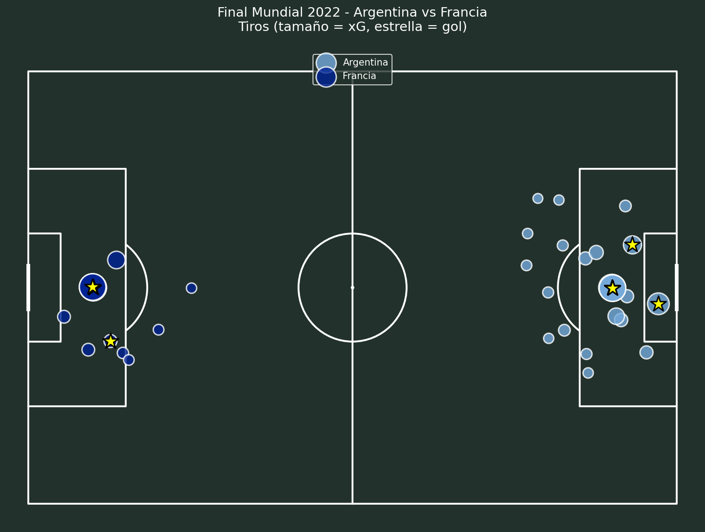
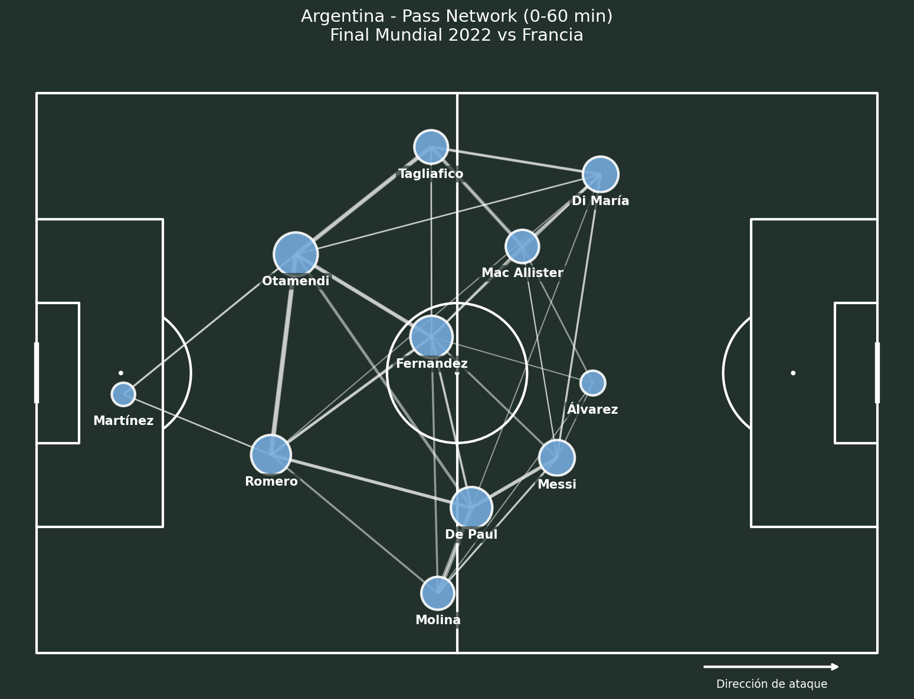
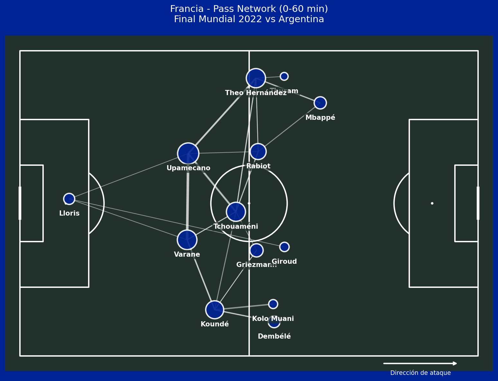

# Football Analytics Portfolio

Portafolio de análisis de datos en fútbol usando Python, StatsBomb Open Data y herramientas modernas de visualización deportiva.

## Stack Técnico

- **Lenguajes:** Python, SQL
- **Procesamiento:** pandas, numpy, DuckDB
- **Visualización:** matplotlib, mplsoccer, seaborn
- **Modelado:** scikit-learn, socceraction
- **Datos:** StatsBomb Open Data

## Proyectos

### 1. Análisis Final Mundial 2022 - Argentina vs Francia ✓

Análisis completo del partido con visualizaciones tácticas:
- Shot map con xG por equipo
- Pass network de los primeros 60 minutos
- Métricas de posesión, precisión de pases y jugadores más activos

**Notebooks:** `notebooks/01_explorando_statsbomb.ipynb`, `notebooks/02_anatomia_partido.ipynb`

**Visualizaciones:**





### 2. Modelo xG Propio
*Próximo proyecto*

## Setup

```bash
python -m venv .venv
.venv\Scripts\activate
pip install -r requirements.txt
```

## Autor

**Alexis Zapata** - Analista de Datos | BI
- Linkedin: [Alexis Zapata](https://linkedin.com/in/alexiszapata19)
- GitHub: [@szkad](https://github.com/szkad)